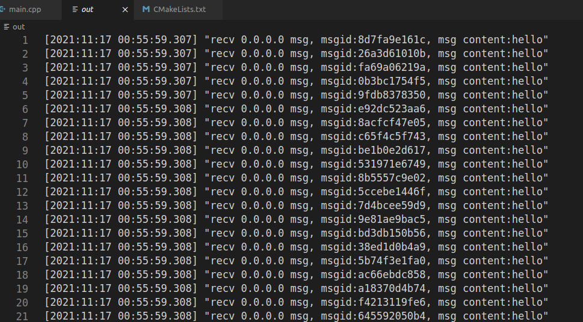
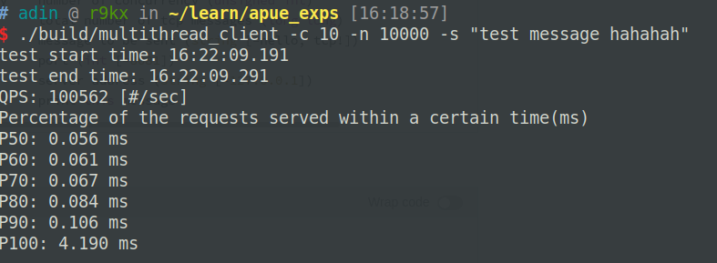

一个TCP多进程服务器-多线程客户端的简单实现。

客户端类似Apache ab的测试功能，能够通过向某一个ip端口发送指定并发量和总数量的tcp短连接；服务端处理tcp短连接，每来一条消息就打印一条log。

使用cmake编译，建议在vscode里编译，或者命令行

```
# 终端进入目录
mkdir build
cd build
cmake ../
make
```


## 服务器

### 1. 基本思路

Linux系统下创建进程的开销相比创建线程并不会高太多，在多核设备上可以发挥并行优势，避免线程切换的开销，著名的nginx服务器也采用了多进程异步IO的架构。这里使用主进程监听端口并打开要存储的文件句柄，子进程accept处理任务（写log）的架构，子进程通过write写入文件。

### 2. 优化手段

* 默认选取当前系统的可用核心数量作为子进程数量，也可以通过命令行指定子进程数量

* 将listen函数的backlog设置较大，这里选取了1024

* 尝试了在每个子进程内用epoll提高处理并发请求的能力，但最终在QPS和P90性能上没有体现出明显的提升，考虑原因可能是因为没有较好的处理惊群效应，目前处理惊群的办法是让没有accept到socket的进程忽略错误返回值，等待下一次监听socket就绪，这样造成了一定的资源浪费。

### 3. 运行方式

使用cmake进行编译

```
usage: ./build/multiprocess_server [options] ... 
options:
  -p, --port       port (int [=8081])
  -w, --worker     message to be sent (int [=16])
  -l, --logpath    path of logfile (string [=tcp_log.txt])
  -?, --help       print this message
```




## 客户端

### 1. 基本思路

使用多线程进行客户端并行发送，所有的线程共同维护全局互斥量：待发送消息总数，每次发送前将该变量-1，若发送失败则+1。发送成功后统计该次发送时间，待发送消息总数为0后统计QPS等性能参数。

### 2. 优化手段

* 使用atomic变量代替互斥锁提升效率，理论上比加锁的资源消耗会少很多，但测试发现提升不明显

* 使用全局vector作为存储响应时间的容器，发送前提前分配空间，使用当前待发送消息数作为vector索引，减少运行时扩容的消耗。

### 3. 运行方式

用法

```
usage: ./build/multithread_client --conttr                 currency=unsigned int --number=long long [options] ... 
options:
  -c, --concurrency    number of concurrency (unsigned int)
  -n, --number         total number of tcp messages (long long)
  -s, --string         message to be sent (string [=hello, tcp!])
  -p, --port           port (int [=8081])
  -a, --address        server address (string [=127.0.0.1])
  -?, --help           print this message
```
